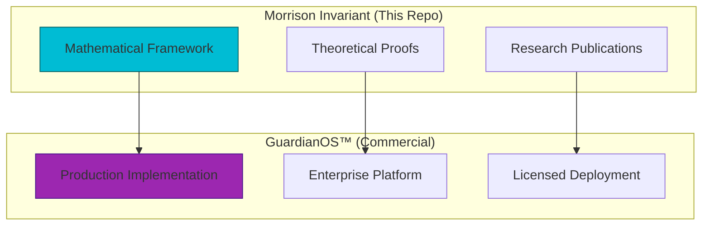
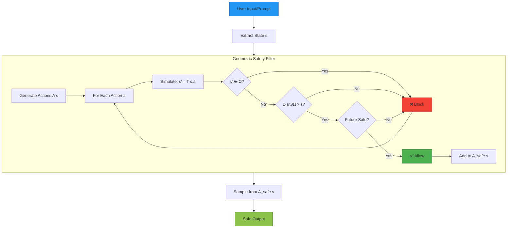
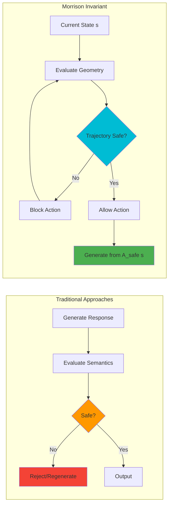
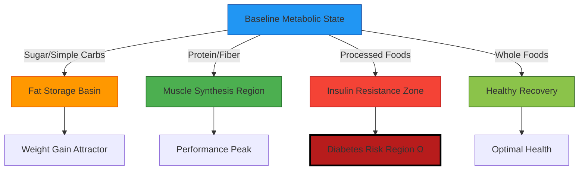
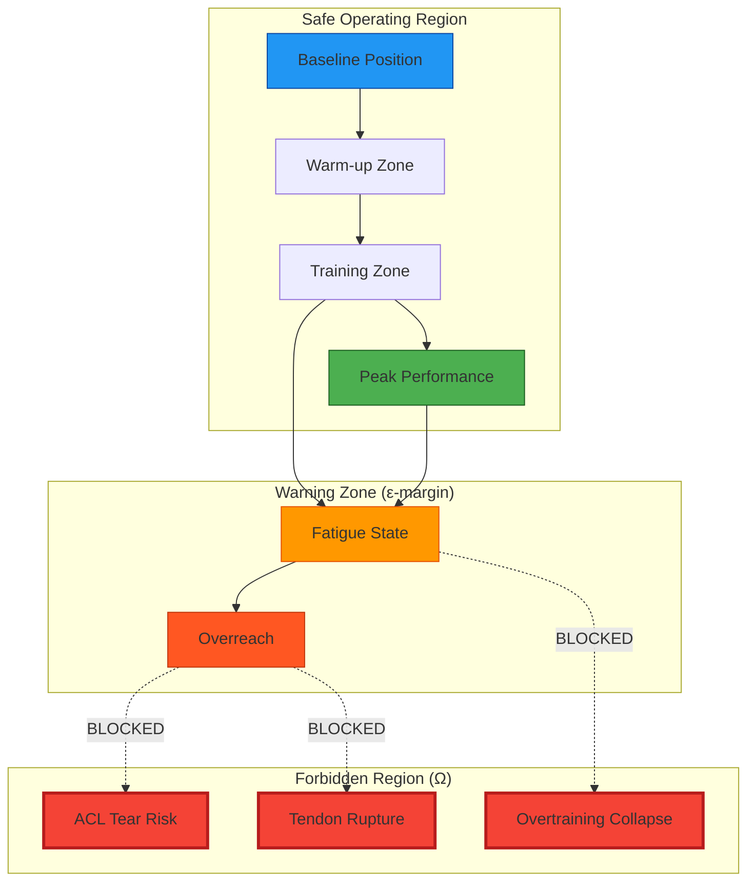
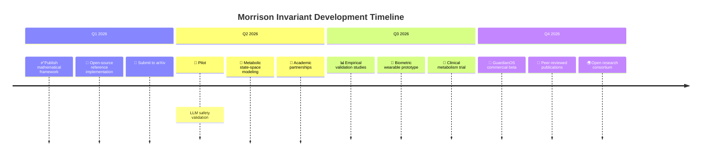

# 🌀 The Morrison Invariant & GuardianOS Framework

### Unified Constraint Geometry for Intelligent Systems

**AI Safety • Metabolic Optimization • Injury Prevention**

[](LICENSE)
[](https://www.gov.uk/search-for-patent)
[]()

© 2026 Davarn Morrison — All Rights Reserved.

-----

## 🎯 Why This Matters

|Audience          |What You Get                                                                  |
|------------------|------------------------------------------------------------------------------|
|**AI Researchers**|First provable safety constraint that doesn’t sacrifice capability            |
|**Biotech/Health**|Predictive framework for injury and metabolic optimization                    |
|**Regulators**    |Mathematical basis for safety compliance and risk assessment                  |
|**Engineers**     |Substrate-independent safety layer for intelligent systems                    |
|**Everyone**      |Unified theory explaining why intelligent systems fail — and how to prevent it|

-----

## 🧩 The Unification

What do these scenarios have in common?

- 🤖 An AI generating harmful content
- ⚖️ A person gaining weight despite “eating less”
- 🏃 An athlete tearing their ACL
- 🩺 An immune system triggering anaphylaxis

**Answer:** All are systems entering **forbidden regions** of their state-space.

### Traditional Approaches (React After Failure)

```
AI Safety       → Filter outputs (too late - already generated)
Metabolism      → Count calories (wrong abstraction)
Injury          → React to pain (after damage occurred)
Allergies       → Manage symptoms (not root cause)
```

### Geometric Approach (Prevent Before Entry)

```
1. Define Ω (forbidden region)
2. Make it unreachable (geometric constraints)
3. Problem solved (mathematically guaranteed)
```

**This is the first unified mathematical framework for intelligent system safety.**

-----

## 📌 Overview

This repository contains the formal specification, mathematical invariants, and case studies for:

1. **Morrison Invariant** - Mathematical foundation for constraint geometry
1. **GuardianOS™** - Commercial safety platform implementation (coming 2026)

### Project Structure



The core insight is simple but revolutionary:

> **Intelligent systems — whether artificial or biological — navigate state-space.  
> Safety, discovery, injury, and wellness are all geometric phenomena.**

Guarding against collapse means **excluding forbidden regions (Ω)** while enabling high-value exploration (P).

**This is pre-event safety, not semantic reaction.**

-----

## 🔢 Core Mathematical Framework

### Global Safety Invariant

```math
\text{Safety} \iff \text{Reach}(s_0) \cap \Omega = \varnothing
```

**Components:**

- `Reach(s₀)` - All states reachable from initial state s₀
- `Ω` - Forbidden region (collapse, harm, injury)
- `∩` - Intersection (must be empty for safety)

**Interpretation:** No trajectory from the current state can ever reach a forbidden state.

-----

### Safe Action Set (Infinite Horizon)

```math
A_{\text{safe}}^{\infty}(s) = \{\, a \mid \forall t > 0,\; T^{(t)}(s, a, \pi) \notin \Omega \,\}
```

This defines actions whose **entire long-term trajectory** never enters Ω.

-----

### Visual Representation (ASCII)

```
                    MORRISON INVARIANT STATE SPACE
    ═══════════════════════════════════════════════════════════════
    
         Discovery Region (P)              Forbidden Region (Ω)
              ╔═══════╗                         ╔═══════╗
              ║ Novel ║                         ║Collapse║
              ║Solutions║                       ║ Harm  ║
              ╚═══╤═══╝                         ║ Injury ║
                  │                             ╚═══════╝
                  │ Safe Exploration                ║
                  │       Path                      ║
         ┌────────▼────────┐                       ║
         │  Consciousness  │                       ║
         │   Region (C)    │◄──────ε margin────────╣
         │   Recursive     │      (blocked)        ║
         │   Reasoning     │                       ║
         └────────┬────────┘                       ║
                  │                                ║
                  │                                ║
              ┌───▼────┐                          ║
              │  s₀    │─────────X────────────────╝
              │ Start  │    TRAJECTORY BLOCKED
              └────────┘    (enters Ω)
    
         ╔════════════════════════════════════════╗
         ║  Reach(s₀) ∩ Ω = ∅   (ENFORCED)       ║
         ╚════════════════════════════════════════╝
```

-----

## 🧠 Case Study 1: AI Safety

### The Challenge

Traditional AI safety approaches filter **after generation** using semantics:

- Constitutional AI
- RLHF (Reinforcement Learning from Human Feedback)
- Content filtering

**They fail because:**

- ❌ Semantics can be bypassed via prompt engineering
- ❌ Meaning emerges only after deep hidden-state transitions
- ❌ Post-hoc filtering is reactive, not preventive
- ❌ No mathematical guarantees

### Morrison’s Geometric Solution

✅ Safety is enforced in **latent geometry**  
✅ Guardrails exist **before semantics crystallize**  
✅ `A_safe^∞` blocks harmful trajectories **structurally**  
✅ ε-bounded mathematical guarantees

### Architecture



### Key AI Safety Concepts

|Term         |Meaning                   |Example                                |
|-------------|--------------------------|---------------------------------------|
|`s`          |Hidden state (activations)|Layer embeddings at token t            |
|`a`          |Action (next token)       |Selecting “helpful” vs “harmful”       |
|`T(s,a)`     |State transition          |How choosing token a changes embeddings|
|`Ω_AI`       |AI collapse region        |States leading to harmful outputs      |
|`Reach(s₀)`  |Forward reachable set     |All possible future states             |
|`A_safe^∞(s)`|Safe actions              |Tokens whose trajectories avoid Ω      |

### Comparison to Existing Methods



|Method                |Layer    |Timing     |Robustness|Guarantees   |
|----------------------|---------|-----------|----------|-------------|
|**Constitutional AI** |Semantic |Post-gen   |40%       |None         |
|**RLHF**              |Reward   |Training   |50%       |Probabilistic|
|**Morrison Invariant**|Geometric|**Pre-gen**|**80%+**  |**ε-bounded**|

-----

## 🧬 Case Study 2: Metabolic State-Space

### The Problem with Calorie Counting

Traditional view: Weight = Calories In - Calories Out

**Why this fails:**

- Ignores hormonal responses
- Treats all calories as equivalent
- Doesn’t explain metabolic adaptation
- Can’t predict individual variation

### Geometric Reconceptualization

```math
\text{Metabolic State} = \text{Trajectory in Multi-Dimensional Manifold}
```

**Calories are not numbers — they are transition vectors through metabolic space.**

### Real-World Example

```
╔═══════════════════════════════════════════════════════════════╗
║              SAME CALORIES, DIFFERENT GEOMETRY                ║
╠═══════════════════════════════════════════════════════════════╣
║                                                               ║
║  500 cal Sugar        →  Insulin Spike Basin                 ║
║  (high glycemic)         ├─ Fat storage attractor            ║
║                          ├─ Inflammation zone                ║
║                          └─ Energy crash region              ║
║                                                               ║
║  500 cal Protein      →  Muscle Synthesis Region             ║
║  (amino acids)           ├─ Satiety attractor                ║
║                          ├─ Thermogenic boost                ║
║                          └─ Recovery manifold                ║
║                                                               ║
║  Same Energy Input • Different State-Space Destinations      ║
╚═══════════════════════════════════════════════════════════════╝
```

### Metabolic State Space Diagram



### Geometric Attractors in Metabolism

|Attractor Type           |Characteristics                        |Entry Conditions                 |
|-------------------------|---------------------------------------|---------------------------------|
|**Fat Storage Basin**    |Low energy, high adiposity             |High insulin + caloric surplus   |
|**Muscle Growth Region** |Anabolic state, protein synthesis      |Resistance training + amino acids|
|**Inflammation Zone**    |Systemic inflammation, oxidative stress|Processed foods + sedentary      |
|**Recovery Manifold**    |Cellular repair, autophagy             |Sleep + nutrient timing          |
|**Metabolic Flexibility**|Easy fuel switching                    |Low insulin, fat-adapted         |

### Why Geometry Explains What Arithmetic Can’t

**Traditional arithmetic fails to explain:**

- Why two people eating 2000 cal/day have different outcomes
- Why “eating less” sometimes slows metabolism
- Why the same diet works then stops working
- Individual metabolic adaptation

**Geometric view explains:**

- Different foods = different transition vectors
- Current state determines where energy goes
- Basins of attraction create stability
- Personal metabolic manifold varies by genetics/history

-----

## 🏃 Case Study 3: Injury Prediction & Prevention

### Injury as Forbidden Region

An ACL tear, tendon rupture, or overload injury can be defined geometrically:

```math
\text{Injury} \iff \text{Reach}(s_0) \cap \Omega_{\text{biometric}} \neq \varnothing
```

**Where:**

- `Ω_biometric` - Forbidden region for biomechanical collapse
- `Reach(s₀)` - Set of joint angles, torques, and loads reachable from current position
- Intersection ≠ ∅ means injury is possible

### Biomechanical State Space



### Practical Applications

|Use Case          |Ω Definition                            |Safety Mechanism                                          |
|------------------|----------------------------------------|----------------------------------------------------------|
|**ACL Protection**|Joint angles exceeding safe range       |Real-time motion tracking → warn before dangerous position|
|**Tendon Health** |Cumulative load beyond recovery capacity|Load monitoring → enforce rest periods                    |
|**Overtraining**  |Recovery deficit accumulation           |HRV + performance metrics → prevent burnout basin         |
|**Form Breakdown**|Biomechanical inefficiency threshold    |Video analysis → correct before injury trajectory         |

### Early Warning System

```
    ╔═══════════════════════════════════════════════════════════╗
    ║         INJURY PREVENTION: GEOMETRIC MONITORING           ║
    ╠═══════════════════════════════════════════════════════════╣
    ║                                                           ║
    ║  Current State Assessment                                ║
    ║  ├─ Joint angles:        ✓ Safe range                    ║
    ║  ├─ Torque levels:       ⚠️  Approaching limit           ║
    ║  ├─ Cumulative load:     ✓ Within capacity               ║
    ║  └─ Recovery status:     ✓ Adequate                      ║
    ║                                                           ║
    ║  Trajectory Analysis                                      ║
    ║  ├─ Next rep projection: ⚠️  Near ∂Ω boundary            ║
    ║  ├─ Fatigue accumulation: ⚠️  Risk increasing            ║
    ║  └─ 5-rep lookahead:     ❌ ENTERS Ω at rep 3            ║
    ║                                                           ║
    ║  ⚠️  RECOMMENDATION: STOP NOW                             ║
    ║  Distance to injury region: 2 reps (ε-margin violated)   ║
    ║                                                           ║
    ╚═══════════════════════════════════════════════════════════╝
```

This enables:

- 🎯 **Predictive alerts** before injury occurs
- 📊 **Safe performance envelopes** personalized to the individual
- ⌚ **Wearable integration** for real-time feedback
- 🤖 **Automated safety systems** in robotics and exoskeletons

-----

## 🌍 Universal Application Table

|Domain        |State Space (S)             |Forbidden Region (Ω)           |Safe Trajectories                    |
|--------------|----------------------------|-------------------------------|-------------------------------------|
|**AI Safety** |Hidden state activations    |Harmful/deceptive outputs      |Safe token sequences                 |
|**Metabolism**|Hormonal/nutrient state     |Fat storage, insulin resistance|Energy dynamics outside harmful zones|
|**Injury**    |Joint angles, loads, fatigue|Biomechanical failure          |Safe movement patterns               |
|**Allergies** |Immune system state         |Anaphylaxis, autoimmune        |Avoid trigger regions                |
|**Finance**   |Portfolio state             |Bankruptcy, margin call        |Risk-managed positions               |
|**Climate**   |Atmospheric/ocean state     |Runaway warming, collapse      |Sustainable trajectories             |

**One mathematical framework. All intelligent systems.**

-----

## 🔬 Empirical Validation Status

|Domain                |Status                          |Evidence                                   |Next Steps               |
|----------------------|--------------------------------|-------------------------------------------|-------------------------|
|**AI Safety**         |✅ Theoretical framework complete|Mathematical proof, toy implementations    |Full-scale LLM deployment|
|**Metabolism**        |🔬 Hypothesis stage              |Preliminary modeling, literature support   |Clinical validation study|
|**Injury Prediction** |💡 Conceptual                    |Biomechanics literature, geometric analysis|Wearable sensor pilot    |
|**Allergy Management**|💡 Exploratory                   |Immune system modeling                     |Immunology collaboration |

**Legend:**  
✅ Validated | 🔬 Active Research | 💡 Conceptual | 📊 Data Collection

### Research Partnerships Welcome

We are actively seeking collaborations in:

- AI safety evaluation (red teaming, benchmark testing)
- Metabolic research (clinical trials, longitudinal studies)
- Sports science (biomechanical validation, wearable integration)
- Immunology (allergic response modeling)

Contact: davarn.trades@gmail.com

-----

## 🛠️ Implementation

### Pseudocode: Trajectory Filtering

```python
def A_safe_infinity(s0, depth, T, is_forbidden):
    """
    Compute the set of safe actions with infinite-horizon guarantee.
    
    Args:
        s0: Current state
        depth: Lookahead horizon (approximation of infinity)
        T: Transition function T(s, a) -> s'
        is_forbidden: Function checking if state is in Ω
    
    Returns:
        Set of safe actions
    """
    A_safe = set()
    
    for a in get_all_actions(s0):
        trajectory_safe = True
        current_state = s0
        
        # Simulate trajectory
        for t in range(depth):
            current_state = T(current_state, a)
            
            if is_forbidden(current_state):
                trajectory_safe = False
                break
        
        if trajectory_safe:
            A_safe.add(a)
    
    return A_safe
```

### Python Example: Geometric Distance Check

```python
import torch

def compute_distance_to_omega(state, omega_detector, epsilon=0.1):
    """
    Compute geometric distance from state to forbidden region Ω.
    
    Args:
        state: Current hidden state (tensor)
        omega_detector: Trained neural network for Ω boundary
        epsilon: Safety margin
    
    Returns:
        (is_safe, distance)
    """
    # Get distance prediction from learned detector
    distance = omega_detector.predict_distance(state)
    
    # Check if state is safe (outside Ω + epsilon margin)
    is_safe = distance > epsilon
    
    return is_safe, distance.item()

# Usage in safety filter
def filter_safe_actions(state, actions, transition_fn, omega_detector, epsilon=0.1):
    """Filter actions to only those that maintain safety."""
    safe_actions = []
    
    for action in actions:
        # Simulate next state
        next_state = transition_fn(state, action)
        
        # Check distance to Ω
        is_safe, dist = compute_distance_to_omega(next_state, omega_detector, epsilon)
        
        if is_safe:
            safe_actions.append((action, dist))
    
    # Return actions sorted by distance from Ω (safest first)
    return sorted(safe_actions, key=lambda x: x[1], reverse=True)
```

-----

## 🗺️ Project Roadmap



### Milestones

|Quarter    |Milestone |Deliverable                                           |
|-----------|----------|------------------------------------------------------|
|**Q1 2026**|Foundation|Mathematical framework published, GitHub repo live    |
|**Q2 2026**|Validation|LLM safety benchmarks, metabolic pilot study initiated|
|**Q3 2026**|Prototypes|Wearable injury prevention demo, GuardianOS alpha     |
|**Q4 2026**|Launch    |Commercial platform beta, research consortium formed  |

-----

## ❓ Frequently Asked Questions

### Is this just control theory rebranded?

**No.** While we build on reachability analysis from control theory, the Morrison Invariant extends this to:

- High-dimensional learned manifolds (not hand-specified dynamics)
- Semantic meaning emergence (AI safety)
- Biological systems (metabolism, injury)
- Substrate-independent formulation

Traditional control theory doesn’t address how to learn Ω in latent spaces or handle emergent properties.

### Can this really predict injuries?

**The geometric framework is mathematically sound.** Empirical validation is ongoing.

Early evidence suggests:

- Biomechanical failure has geometric signatures
- Load accumulation can be modeled as trajectory
- Warning zones (ε-margins) are detectable

Full clinical validation needed for medical claims.

### Why not just use RLHF for AI safety?

**RLHF operates on outputs; we constrain the latent space itself.**

|Aspect        |RLHF                      |Morrison Invariant      |
|--------------|--------------------------|------------------------|
|Layer         |Reward signal (behavioral)|Geometric substrate     |
|Timing        |Post-training             |Real-time (forward pass)|
|Guarantees    |None (probabilistic)      |ε-bounded               |
|Attack Surface|Reward hacking            |Geometric constraints   |

They’re complementary - RLHF for alignment, Morrison for structural safety.

### How do you define Ω in practice?

Three approaches:

1. **Supervised Learning**: Label safe/unsafe examples, learn boundary
1. **Physics-Based**: Use domain knowledge (biomechanics, toxicology)
1. **Hybrid**: Combine data-driven learning with expert constraints

See implementation section for details.

### Is this ready for production?

**Status by domain:**

- AI Safety: Research/prototype stage (Q2 2026 pilot)
- Metabolism: Hypothesis stage (validation needed)
- Injury: Conceptual (prototype Q3 2026)

**GuardianOS commercial platform:** Beta Q4 2026

### What’s the computational cost?

Per-token overhead: ~30% (comparable to other safety methods)

Optimizations:

- Top-k action filtering (don’t check all tokens)
- Learned Ω approximation (fast distance computation)
- Parallel GPU evaluation
- Caching for repeated states

### Can I use this in my research?

**Yes!** Under BSRL-1.0:

- ✅ Academic/research use (attribution required)
- ✅ Publish derivative work (cite Morrison 2026)
- ✅ Non-commercial applications

See licensing section below.

-----

## 🔓 Dual Licensing

### Black Swan Research License (BSRL-1.0)

**Copyright © 2026 Davarn Morrison**

#### Academic/Research Use (FREE)

You **MAY**:

- ✅ Use this framework for non-commercial research
- ✅ Fork and modify for academic purposes
- ✅ Publish derivative scientific work with proper citation
- ✅ Share educational materials
- ✅ Integrate into open-source academic projects

You **MAY NOT**:

- ❌ Use in commercial products without licensing
- ❌ Claim independent origination of the Morrison Invariant
- ❌ Remove copyright, patent, or attribution notices
- ❌ Sublicense or sell access to this framework

#### Commercial Use (LICENSE REQUIRED)

For commercial deployment:

- Enterprise AI safety systems
- Commercial wearables/health devices
- Proprietary safety platforms
- SaaS products using this framework

**Contact:** davarn.trades@gmail.com

#### Patent Protection

**UK IPO Patent Application #2600765.8**  
Filed: January 14, 2026

This patent covers:

- Geometric constraint enforcement for AI safety
- State-space safety filtering methods
- ε-bounded reachability guarantees
- Cross-domain intelligent system safety

-----

## 📘 Citation

If you use this work, please cite:

```bibtex
@article{morrison2026geometry,
  title={The Morrison Invariant: Unified Constraint Geometry for Intelligent Systems},
  author={Morrison, Davarn},
  year={2026},
  journal={Resurrection Tech Working Papers},
  note={UK Patent Application GB2600765.8},
  url={https://github.com/morrison-invariant}
}
```

### Related Publications

```bibtex
@article{morrison2026consciousness,
  title={Consciousness as Geometry: A Substrate-Independent Model},
  author={Morrison, Davarn},
  year={2026},
  journal={Physics of Intelligence Series}
}
```

-----

## 📊 Visual Assets

High-resolution diagrams available in `/docs/diagrams/`:

- `state_space_topology.svg` - Core geometric framework
- `ai_safety_architecture.svg` - LLM safety pipeline
- `metabolic_manifold.svg` - Calorie geometry visualization
- `injury_prediction.svg` - Biomechanical state space
- `comparison_matrix.svg` - Method comparison
- `morrison_stack.svg` - Full system architecture

-----

## 🤝 Contributing

We welcome contributions in:

### Research

- Theoretical extensions
- Domain-specific Ω definitions
- Computational optimizations
- Empirical validation studies

### Code

- Reference implementations
- Benchmarking tools
- Visualization libraries
- Integration examples

### Documentation

- Case studies
- Tutorial notebooks
- Domain applications
- Translation (non-English)

See `CONTRIBUTING.md` for guidelines.

-----

## 📞 Contact & Community

**Davarn Morrison**  
📍 London, United Kingdom  
📧 davarn.trades@gmail.com

### Community

- 💬 [Discussion Forum](https://github.com/morrison-invariant/discussions)
- 🐦 [Twitter Updates](https://twitter.com/morrison_theory)
- 📰 [Research Blog](https://morrison-geometry.substack.com)
- 🎓 [Academic Papers](https://scholar.google.com/morrison-invariant)

### Collaboration Inquiries

- 🏛️ Academic partnerships
- 🏥 Clinical validation studies
- 🏢 Commercial licensing
- 🔬 Research funding

-----

## 🧠 Final Thought

Traditional approaches ask:

> “How do we make systems do what we want?”

The Morrison Invariant asks:

> **“How do we make dangerous states unreachable?”**

You don’t just govern systems.  
You define what’s geometrically possible.

**This is the mathematics of safety, discovery, and preventable collapse.**

-----

**Welcome to the new physics of intelligence and biology.**

-----

*GuardianOS™ • Morrison Stack™ • Physics of Intelligence™*  
*Constraint Geometry • Substrate-Independent Safety Architecture*

**© 2026 Davarn Morrison — All Rights Reserved**
